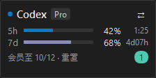

# Codex Quota Widget

一个适用于 Windows 的 Codex 额度桌面小组件。它以 VS Code 深色界面风格显示当前账号的 5 小时额度、7 天额度、重置倒计时、会员到期时间和可用重置次数。

> 默认模式通过本机 Codex app-server 的只读 JSON-RPC 接口读取当前账号。使用 `--demo` 可运行静态演示数据；会员到期字段在当前 app-server 响应中不可用时会显示“会员期限未知”。

## 本机效果



截图来自本机 `--demo` 模式，记录的是组件实际渲染效果；真实模式会按账号返回的窗口动态显示，Pro 20× 只有周额度时不会强行显示 5 小时行。

## 当前能力

- 右下角固定尺寸悬浮窗，尺寸约 224×112 px，尽量减少对桌面的遮挡。
- 深色、低干扰、接近 VS Code 的界面风格。
- 展示 5 小时和 7 天两个额度窗口，以及各自的剩余时间。
- 展示会员到期日期和可用重置次数；接口未提供会员到期字段时显示未知。
- 窗口可拖动，关闭后释放刷新计时器。
- 每 10 秒自动刷新额度；刷新中的请求不会并行叠加。
- 额度数据通过 `IQuotaProvider` 抽象，后续接入真实数据不需要重写 UI。
- Pro 20× 只有周额度时自动隐藏 5 小时行，不把不存在的额度窗口显示成 0%。

## 运行

需要 Windows、.NET 8 SDK 和桌面运行时：

```powershell
dotnet run --project .\CodexQuotaWidget.csproj
```

需要只验证 UI 时：

```powershell
dotnet run --project .\CodexQuotaWidget.csproj -- --demo
```

发布单文件版本：

```powershell
dotnet publish .\CodexQuotaWidget.csproj -c Release -r win-x64 --self-contained false
```

## 目录

- `MainWindow.xaml`：小组件布局和 VS Code 风格视觉。
- `ViewModels/QuotaViewModel.cs`：倒计时、10 秒刷新和界面状态。
- `Services/QuotaProvider.cs`：额度提供器接口与本地演示实现。

## 后续计划

1. 增加系统托盘入口和开机启动选项。
2. 增加账号切换配置，但主悬浮窗始终只展示一个当前账号。
3. 在当前 app-server 能力之外补充可读取的会员到期数据源。

## 许可证

MIT License
