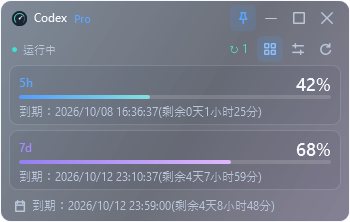

# Codex Quota Widget

Windows 桌面额度小组件，用紧凑的玻璃渐变界面显示当前 Codex 账号的剩余额度、重置时间、会员到期时间和可用重置次数。最新安装包见 [Releases](https://github.com/danterange/codex-quota-widget/releases/latest)，源码版本以 `CodexQuotaWidget.csproj` 为准。

## 界面截图



截图使用演示数据，不代表真实账号。界面会根据账号实际返回的额度窗口自动布局；例如账号只有 7 天额度时，5 小时额度行会自动隐藏。

## 功能

- 显示 5 小时和 7 天额度窗口、剩余百分比以及各自的重置时间。
- 显示会员/订阅到期时间和剩余天、小时、分钟；可用重置次数显示在右侧徽标中。
- 只使用明确命名的会员到期字段；服务端未返回时，从本机 Codex 登录令牌的订阅声明补齐，不会把额度重置时间误当成会员到期时间。
- 使用本机 Codex app-server 的只读 JSON-RPC 请求读取数据，不修改账号、额度或登录状态。
- 每 10 秒自动刷新，刷新请求不会并行叠加；也可以在设置页选择 5、10、30、60 或 120 秒，或手动刷新。
- 支持简体中文和 English；语言、刷新间隔保存在当前 Windows 用户配置中。
- 默认宽度 350 像素，支持自由调整大小；自定义标题栏提供最小化、最大化/还原、置顶切换和关闭，默认置顶。关闭隐藏到托盘，完全退出使用托盘菜单。
- Windows 11 22H2 及以上支持 Acrylic 背景模糊与渐变；旧系统及高对比度环境回退到不透明背景。
- 托盘菜单支持打开主界面和退出小组件，双击托盘图标也会打开主界面。
- 优先定位 Codex 桌面版自带的原生 `codex.exe`，兼容 `bin/<版本散列>/codex.exe` 路径；找不到时再尝试 PATH 中的 CLI。
- 登录、安装、网络和协议错误会转换为可操作的提示，并保留上一次成功的额度结果。

## 数据来源与登录要求

默认模式会启动一个短生命周期的 Codex app-server 会话，依次发送 `initialize`、`account/read` 和 `account/rateLimits/read` 请求。真实模式要求本机已安装并登录 Codex 桌面应用或 CLI，并使用 ChatGPT 账号；API Key 登录不提供 Plus / Pro 订阅额度。

会员到期时间按以下顺序读取：

1. `account/read` 返回且名称明确表示会员或订阅到期的字段。
2. 本机 `CODEX_HOME/auth.json`（未设置时为用户目录下的 `.codex/auth.json`）中登录令牌的 `chatgpt_subscription_active_until` 声明。

令牌只在进程内解析，不写入日志、配置文件或界面。

## 下载与安装

[下载最新版本](https://github.com/danterange/codex-quota-widget/releases/latest)

Windows 10/11 x64 用户下载 `*-setup.exe` 后双击安装；也可以下载 ZIP，解压后运行 `CodexQuotaWidget.exe`。安装包和 ZIP 都自带 .NET 8 运行时，不需要另外安装 SDK。安装器使用当前用户目录，不要求管理员权限。

安装包目前未签名，Windows 可能显示未知发布者或 SmartScreen 提示。升级前先从托盘退出小组件，再安装新版；当前没有程序内自动更新。

## 从源码运行

开发环境需要 Windows、.NET 8 SDK 和 WPF 桌面运行时：

```powershell
dotnet run --project .\CodexQuotaWidget.csproj
```

没有 Codex 登录状态时，可以用演示数据检查界面：

```powershell
dotnet run --project .\CodexQuotaWidget.csproj -- --demo
```

## 构建与验证

执行离线回归检查：

```powershell
dotnet build .\CodexQuotaWidget.csproj -c Release --no-restore
dotnet run --project .\tests\QuotaChecks\QuotaChecks.csproj -c Release
```

在已安装并登录 Codex 的 Windows 环境中，可额外读取一次真实额度并验证定时刷新：

```powershell
dotnet .\tests\QuotaChecks\bin\Release\net8.0-windows\QuotaChecks.dll --live
```

构建自包含安装包、便携 ZIP 和 SHA-256 校验文件（需要 Inno Setup 6）：

```powershell
./scripts/Build-Release.ps1
```

版本发布流程见 [docs/RELEASING.md](docs/RELEASING.md)，发布操作约束见 [docs/发布新版本.md](docs/发布新版本.md)。

## 目录说明

- `MainWindow.xaml` / `MainWindow.xaml.cs`：主界面、设置页、托盘隐藏和窗口行为。
- `ViewModels/QuotaViewModel.cs`：自动刷新、倒计时、语言切换和错误状态。
- `Services/QuotaProvider.cs`：Codex app-server 通信、额度窗口解析和会员到期字段探测。
- `Services/CodexAuthMembershipReader.cs`：从本机登录令牌读取订阅到期时间。
- `Models/`：额度快照、用户设置和本地化文本模型。
- `tests/QuotaChecks/`：协议、登录令牌、设置和 WPF 刷新回归检查。

## 限制

- 目前仅提供 Windows x64 构建，不提供 ARM64 或 x86 专用包。
- 真实额度依赖本机 Codex 安装、ChatGPT 登录状态和网络连接。
- 会员到期字段受 Codex 服务端响应和本地登录令牌格式影响；两处都缺失时显示“会员到期时间未知”。

## 许可证

MIT License
